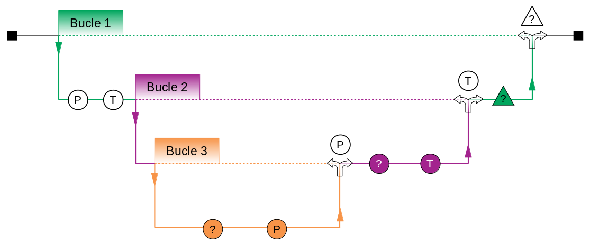

Se presentan los diagramas de flujo de los algoritmos del modelo numérico:

**Diagrama general**

**Diagrama fase A.1.1.**

**Diagrama fase A.1.2.**

**Diagrama fase A.1.3.**

**Diagrama fase A.2.**

