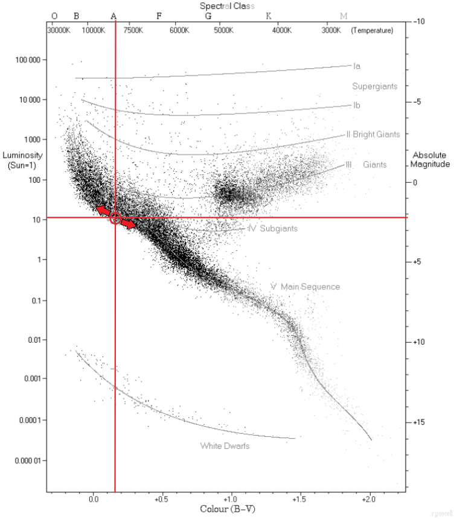

Se presentan las gráficas correspondientes a los resultados obtenidos:

**Mapa de errores relativos para cada par radio-luminosidad**

**Magnitudes a lo lardo del radio de la estrella**

**Localización de la estrella estudiada en el diagrama HR**

Los parámetros iniciales proporcionados inicialmente daban un error relativo elevado. Por ello, decide iterar un total de 7 
veces el modelo numérico introduciendo como nuevos parámetros iniciales los parámetros resultantes de cada repetición:

**Variación de las magnitudes y error relativo en las iteraciones: temperatura central**

**Variación de las magnitudes y error relativo en las iteraciones: luminosidad total**

**Variación de las magnitudes y error relativo en las iteraciones: radio total**

**Variación de las magnitudes y error relativo en las iteraciones: error relativo total**

